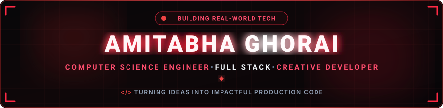
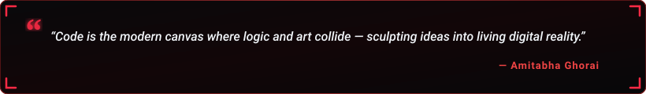

  

  

  
  &nbsp;
  
  &nbsp;
  
  &nbsp;
  
  &nbsp;
  
  &nbsp;
  

  

---

<h2 align="center">🔴 About Me</h2>

  

  

  Hey! I'm <b>Amitabha Ghorai</b>, a passionate <b>Computer Science &amp; Engineering student &amp; developer</b> based in Kolkata, India. 
  Currently studying at <b>Techno India University</b>, I specialize in architecting scalable full-stack web platforms, designing intuitive digital experiences, and building intelligent software solutions to solve real-world problems.

  
  &nbsp;
  
  &nbsp;
  

  💬 <b>Let's Discuss:</b> Java, Python, JavaScript, React, Node.js, Spring Boot, MongoDB &amp; System Architecture. 
  ⚡ <b>Philosophy:</b> <i>"Turning creative late-night thoughts into elegant, production-ready digital products!"</i>

<table width="100%" border="0" align="center">
<tr>
<td width="50%" align="center" style="padding: 14px;">
  <h4>🔭 Flagship Project</h4>
  
<a href="https://github.com/amitabhaGhorai/RealTime-Attendance-System" target="_blank"><b>Real-Time Attendance System</b></a> Smart Automated Attendance &amp; Analytics

</td>
<td width="50%" align="center" style="padding: 14px;">
  <h4>🌱 Active Deep Dives</h4>
  
<b>Full-Stack Engineering &amp; DSA</b> React Ecosystem &amp; Cloud Systems

</td>
</tr>
<tr>
<td width="50%" align="center" style="padding: 14px;">
  <h4>🎨 Creative Developer</h4>
  
<a href="https://github.com/amitabhaGhorai" target="_blank"><b>Modern Web Apps &amp; UI</b></a> Interactive Experiences &amp; Animations

</td>
<td width="50%" align="center" style="padding: 14px;">
  <h4>🤝 Collaboration</h4>
  
<b>AI, Web &amp; Software Solutions</b> Open to internships &amp; exciting projects

</td>
</tr>
</table>

---

<h2 align="center">🔴 Featured Project Spotlight</h2>

<table width="100%" border="0" align="center">
<tr>
<td align="center" style="padding: 22px;">
  <h3>⏱️ Real-Time Attendance System</h3>
  
<i>A smart, web-enabled attendance management platform designed for accurate real-time tracking, fast logging, and automated reporting.</i>

   
  

    
    &nbsp;&nbsp;
    
  

</td>
</tr>
</table>

---

<h2 align="center">🧩 LeetCode Problem Solving</h2>

<i>Live real-time tracker of coding challenges &amp; algorithmic problem-solving milestones.</i>

  

  
  &nbsp;&nbsp;
  

---

<h2 align="center">🛠️ Tech Stack &amp; Skills</h2>

<b>Core Programming Languages</b>

  

<b>Frontend &amp; Mobile Development</b>

  

<b>Backend, Cloud &amp; Databases</b>

  

<b>AI, Data Science, Hardware &amp; DevOps</b>

  

  
  &nbsp;
  
  &nbsp;
  
  &nbsp;
  

---

<h2 align="center">📊 GitHub Analytics &amp; Activity</h2>

  
  &nbsp;&nbsp;
  

  

  

---

<h2 align="center">⚡ Contribution Journey</h2>

  

---

<h2 align="center">📬 Let's Connect &amp; Collaborate</h2>

<i>Whether you want to discuss system architecture, explore project collaborations, or just say hello — my inbox is always open!</i>

<table border="0" align="center">
<tr>
<td align="center" width="220" style="padding: 16px;">
  <a href="https://www.linkedin.com/in/amitabha-ghorai-59085b2b8" target="_blank">
    
      
    
  </a>
   
  <b>Professional Network</b>
</td>
<td align="center" width="220" style="padding: 16px;">
  <a href="https://x.com/gracelovelace13" target="_blank">
    
      
    
  </a>
   
  <b>Social &amp; Updates</b>
</td>
<td align="center" width="220" style="padding: 16px;">
  <a href="mailto:ghoraiamitabha001@gmail.com">
    
      
    
  </a>
   
  <b>Direct Communication</b>
</td>
</tr>
</table>

  

